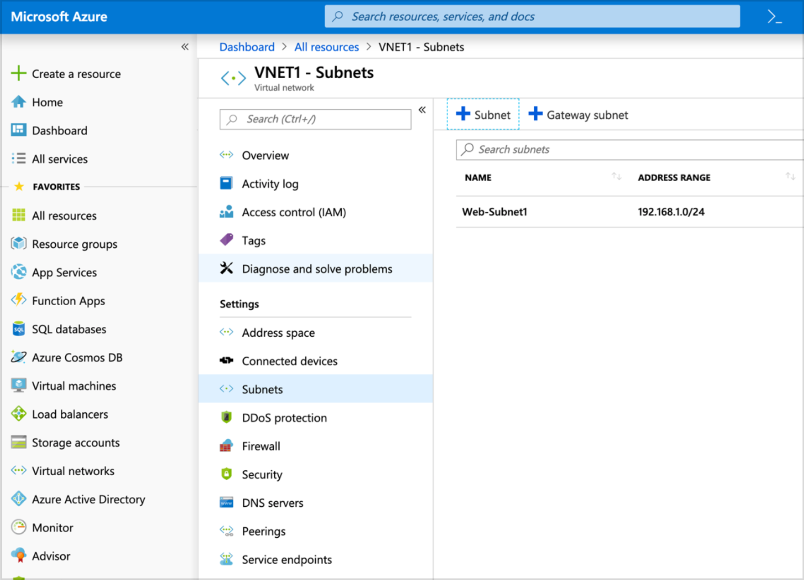
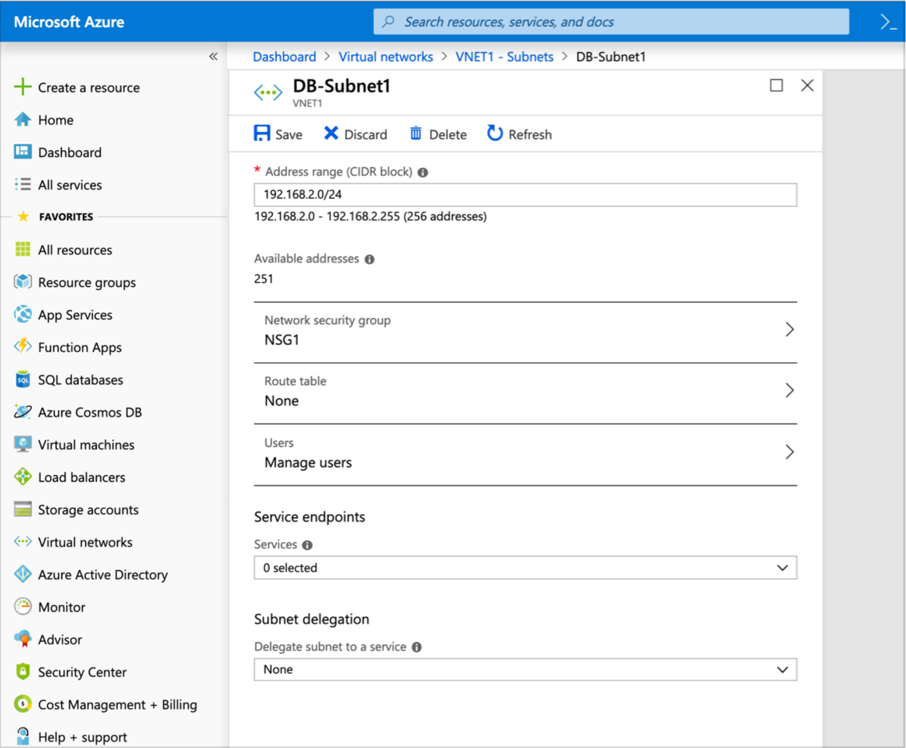
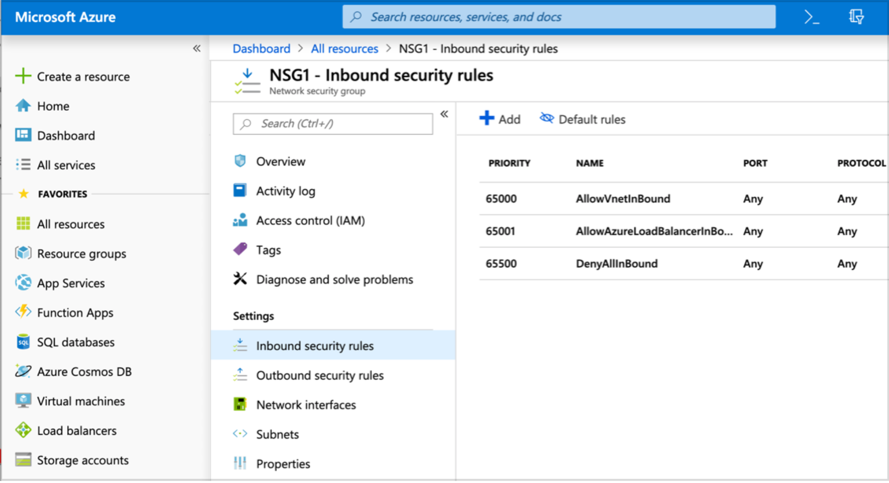

# Azure Networking

## Azure Virtual Network (VNET)


A Virtual Network is a way for resources inside of your cloud to communicate. 
You can setup different subnets, configure firewall rules and customize routing to fit your applications needs. 
Virtual Machines are created inside of these Virtual Networks and
require them to communicate with other VMs and resources.

We will create the following resources in the following Network labs:
1. Virtual Network: VNET1
2. Subnets: Web-Subnet1 and DB-Subnet
3. Network Security Group NSG1
  4. Assign it to DB-Subnet1
  5. Allow MySQL through Security Group NSG


> NOTE: `DB-Subnet1` is for demonstration only. No database VM will be installed.  

### Lab 1: Creating a Virtual Network (VNET)

1. Log into the Azure dashboard
	1. https://portal.azure.com
2. Click + Create a resource > Networking > Virtual Network.

3. Enter the following information

```
Name: VNET1
Address space: 192.168.0.0/16
Resource group: CR1
Location: West US
``````

Web Subnet:
```
Name: Web-Subnet1

Address range: 192.168.1.0/24
```

4. Now click Create and wait until the deployment is complete.

## Lab 2: Creating a Second Subnet

1. Click “All Resources” in the blade on the left side. Click “VNET1” and under “Settings” click “Subnets”



3. Click + Subnet to create the new DB Subnet.
4. Enter the following information:

```
Name: DB-Subnet1
Address range: 192.168.2.0/24
```

3. Click “OK” and wait for the subnet to deploy successfully.


### Network Security Groups (NSG)
A network security group controls access to resources within the subnet. Security groups act as a firewall between different subnets and external access into the cloud environment.
If a service requires access on a specific port this must be allowed through the security group.

> NOTE: Security groups can be applied both at the subnet level and at the Virtual Machine (VM) NIC level.  

### Lab 3: Creating a Network Security Group

1. On the blade click + Create a resource > Networking > Network Security Group.
2. Fill in with the following:

```
Name: NSG1
Resource group: CR1
Location: West US
```

2. Click “OK” to deploy Security Group.

### Lab 4: Assigning Network Security Group to Subnet.

1. Click “All Resources” > click “VNET1” and under “Settings” click “Subnets.
2. Click “DB-Subnet1” and in “Network Security Groups” select “NSG1”
3. Make sure to click “Save” at the top of the page.



## Lab 5: Add MySQL rule to Network Security Group
Now let’s add a rule to allow MySQL traffic through to our servers.

1. On the blade click “All resources”, then click the “NSG1” security group and finally “Inbound security rules”

The default security rules stop all internet traffic to any subnets NSG1 is assigned to. If we want to allow connections through on MySQL we need to add a rule allowing that port.



2. Add MySQL security rule
3. Click “Add” and fill in with the following:

```
Source: Any
Source port ranges: *
Destination: Any
Destination port ranges: 3306
Protocol: TCP
Action: Allow
Priority: 100
Name: MySQL
```

> NOTE: Network Security Groups are found at both the subnet and virtual machine level
and provide two levels of security. They can be customized with different options at each
of these layers and provide fine grained security to protect Azure resources.

